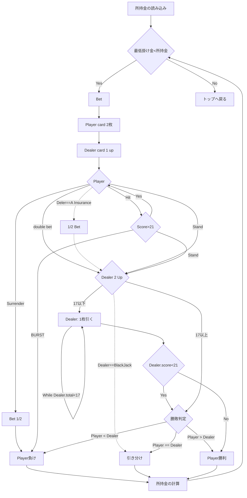

```mermaid
flowchart TD
    A[所持金の読み込み] --> N{最低掛け金<所持金}
    N{最低掛け金<所持金} --> |Yes|B[Bet]
    N{最低掛け金<所持金}--> |No|O[トップへ戻る]
    B[Bet] --> C[カードが配られる]
    C[Player card 2枚]-->D[Dealer card 1 up]
    D[Dealer card 1 up]--> E{Player}
    E{Player}--> |Surrender| F[Bet 1/2]
    E{Player}--> |double bet|H{Dealer 2Up}
    E{Player}-.-> |Deler==A Insurance| G[1/2 Bet]
    G[1/2 Bet]-.->H{Dealer 2Up}
    H{Dealer 2Up}-.-> |Dealer==BlackJack|Z[引き分け]
    E{Player}--> |Stand|H{Dealer}
    E{Player}--> |Hit|I{Score>21}
    I{Score>21}--> |Yes|E{Player}
    F[Bet 1/2]--> X[Player負け]
    I{Score>21}--> |BURST|X[Player負け]
    I{Score>21}-->　|Stand|H{Dealer 2Up}
    H{Dealer 2Up} --> |17以下|K[Dealer: 1枚引く]
    K[Dealer: 1枚引く]-->|While Dealer.total<17|K[Dealer: 1枚引く]
    K[Dealer: 1枚引く] --> M{Dealer.score<21}
    M{Dealer.score<21}--> |Yes|L{勝敗判定}
    L{勝敗判定} --> |Player == Dealer|Z[引き分け]
    L{勝敗判定} --> |Player > Dealer|Y[Player勝利]
    M{Dealer.score<21}--> |No|Y[Player勝利]
    H{Dealer 2 Up} --> |17以上|L{勝敗判定}
    L{勝敗判定} --> |Player < Dealer|X[Player負け]
    X[Player負け]--> W[所持金の計算]
    Z[引き分け]--> W[所持金の計算]
    Y[Player勝利]--> W[所持金の計算]
    W[所持金の計算] --> N{最低掛け金<所持金}
``` 